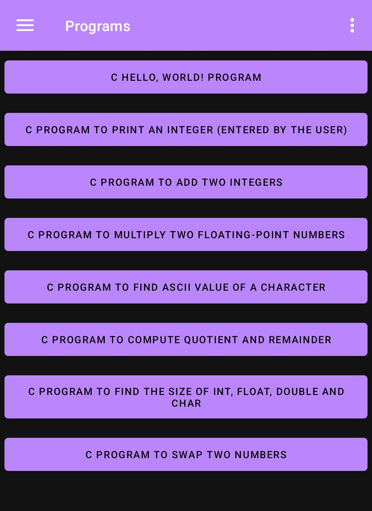

## Explore the world of C programming with our Android learning app, where Java and Android Studio converge to showcase interactive C programs in a seamless educational experience.

# Screenshots

  <!-- Your content goes here -->
  
  
   
  
  

